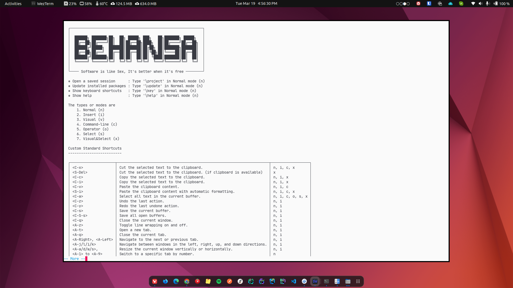

<div align="center">
  <h1>Behansa</h1>
  <p>Ther Minimalist Cross-Platform Code Editor</p>
</div>

[](https://lua.org)

<br>

**Behansa** is a minimalist, Neovim-based code editor designed to run seamlessly within the terminal environment. Embracing the future of code editing, Behansa integrates all major features expected in a modern code editor, alongside advanced Language Server Protocol (LSP) support. By incorporating built-with-AI capabilities, including GitHub Copilot support, Behansa is poised to redefine the coding experience. Currently available in public preview, Behansa invites **developers** to explore its innovative features and contribute to its journey.



Click [here](Screenshot.md) to view more screenshots of the code editor in action.

## Features

- **Neovim-based:** Leverages the extensibility of Neovim for a powerful and customizable editing experience.
- **Advanced LSP Support:** Offers enhanced language server protocol support for comprehensive code analysis and intelligence.
- **Built-with-AI:** Integrates GitHub Copilot, providing AI-powered code suggestions and completions.
- **Terminal-Based:** Runs entirely within the terminal for a streamlined development workflow.
- **WezTerm Support:** Recommended configuration for WezTerm to enhance the terminal experience.

and more...

## Installation

Behansa requires the NPM package manager for installation. Ensure NPM is installed on your system before proceeding with the following steps:

1. **Clone the Repository**

```bash
git clone https://github.com/las-nish/Behansa
```

1. **Install Packer**

```bash
npm run linux:setup:neovim:packer
```

1. **Setup Behansa Configuration**

```bash
npm run linux:setup:behansa
```

2. **Configure WezTerm** (Recommended)

```bash
npm run linux:setup:terminal:wezterm
```

3. **Clean Cache** (If Needed)

```bash
npm run linux:setup:clean
```

## Compatibility

Currently, Behansa is in **public preview** and has been tested exclusively on **Linux** Ubuntu. Users on other platforms are welcome to try Behansa but may encounter issues due to platform differences.

## License

Behansa is open-sourced under the [MIT](LICENSE) License. Contributors and users are free to modify, distribute, and use the software as per the terms of the license.

## Contributing

As Behansa is in public preview, contributions, feedback, and bug reports from the community are highly encouraged. Please refer to the project's GitHub issues page to report bugs or suggest features. For contributing code, kindly submit a pull request with a description of your changes.
